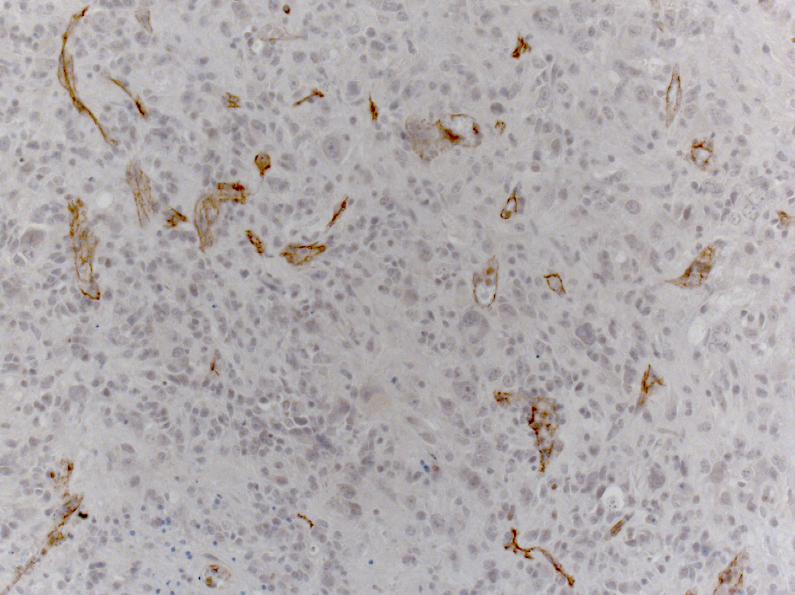
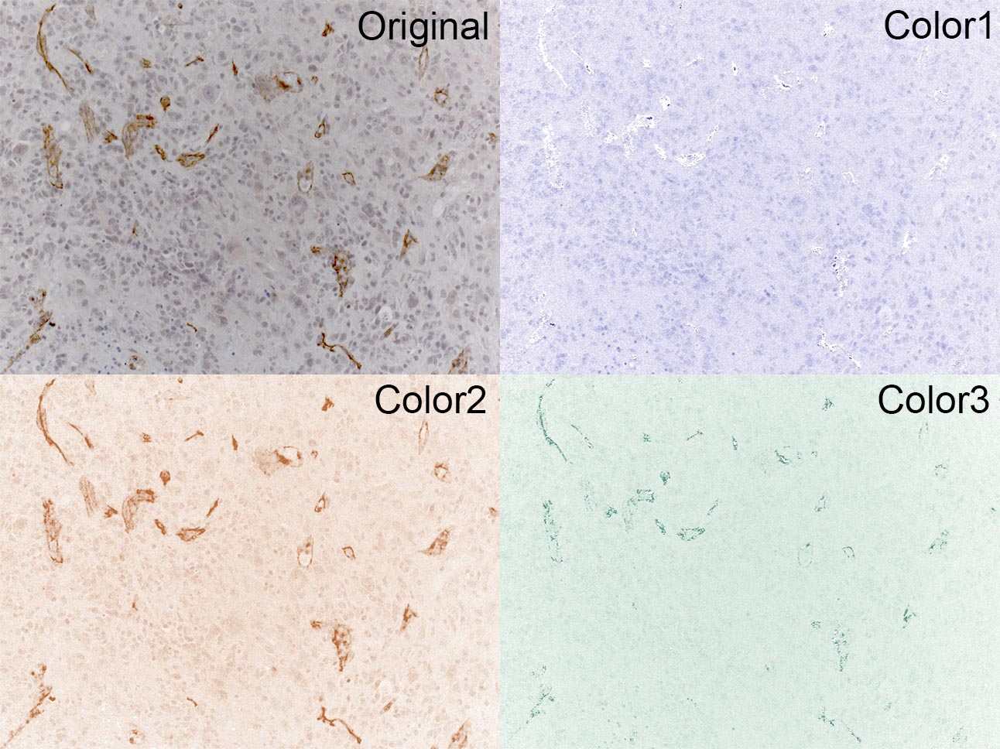
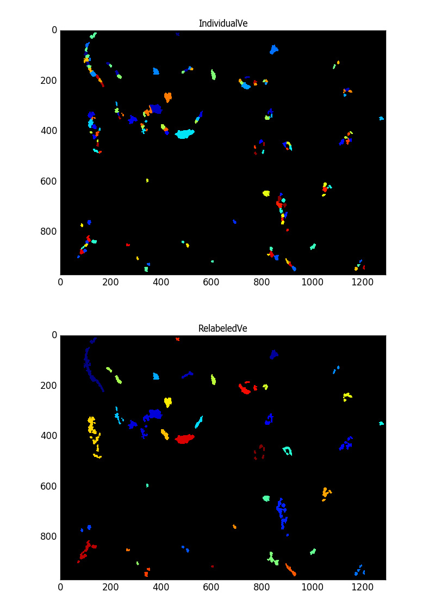

Vessel Quantify for IHC Images
===============================

This repository is to illustrate how to use [imageJ](https://imagej.nih.gov/ij/) or [Fiji](https://fiji.sc/) and [Cell Profiler](http://cellprofiler.org/) to quantify vessel density, length, area quantification for immunohistochemistry images. We will start from the IHC of CD31 staining image below.

## Color Deconvolution

As the signals of interest cannot be simply isolated using channel splitting which is used for immunofluorescence images. Instead, we will apply [Color Deconvolution](http://imagej.net/Colour_Deconvolution). After you drag the image into **ImageJ**, you can use the procedures below.

* `Image` -> `Color` -> `Colour Deconvolution`
* Choose the `Vectors` availeble. Here, we use `H DAB`

The outputs are shown below.

## Binary Mask Generation

The **Color3** channel contains most features of interest. We will convert this channel to black and white binary mask, which will be the input for the **Cell Profiler** pipeline.

* Drag **Color3** to **ImageJ**
* `Image` -> `Type` -> `8-bit`
* `Process` -> `Binary` -> `Make Binary`
* `Edit` -> `Invert`
* Save the image as **TIFF** format (`mask.tif`)

**Note:** You have to save the image as **TIFF** format.

## Quantification Using Cell Profiler

In **CellProfiler**, let's first import the pipeline provided in this repository (`VesselDensity.cppipe`).

* `File` -> `Import` -> `Pipeline from file ...`
* Click `Images` and drag images into the window
* You can use either **Start Test Mode** and **Analyze Images** to adjust parameters and to quantify vessel objects, respectively.

The quantification results are stored in Excel files.

The identified vessel objects are shown below.

